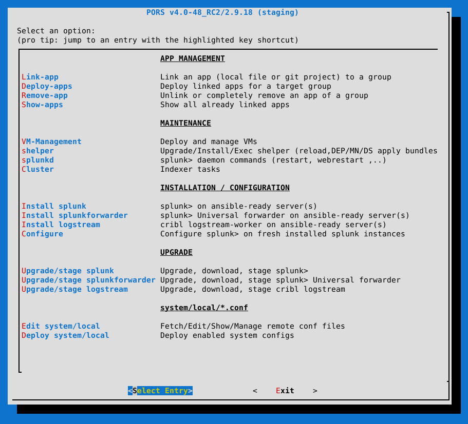

# About / README

PORS is a collection of [Ansible](https://www.ansible.com) playbooks, roles & tasks for installing, configuring & managing your whole Splunk infrastructure - including Apps using the Splunk deployment process. But the icing on the cake is that PORS comes with a terminal UI that does all this with the snap of a finger!

## Requirements

Check the page: [PORS Server Setup](https://github.com/secure-diversITy/ansible_pors/wiki/Installation#pors-server-setup)

## Options / Features

## Guide

[Wiki](https://github.com/secure-diversITy/ansible_pors/wiki)

## Technical documentation

[doxygen](https://secure-diversity.github.io/pors/index.html)

## Ansible Engine ?

Up to v3.9 the whole project was named "Ansible Engine (AE)" which unfortunately conflicted with RedHat's product name: [ansible engine](https://www.ansible.com/products/engine). That's why the whole project has been renamed in v4 to "Playbooks-On-Rails for Splunk (PORS)".
